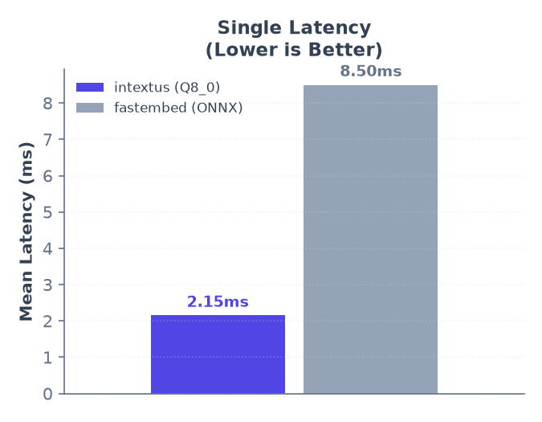
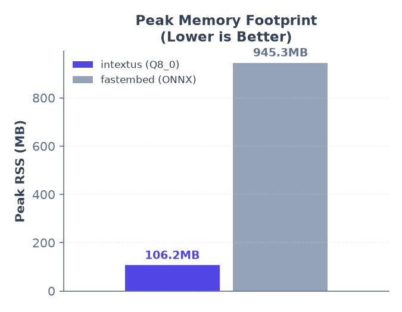
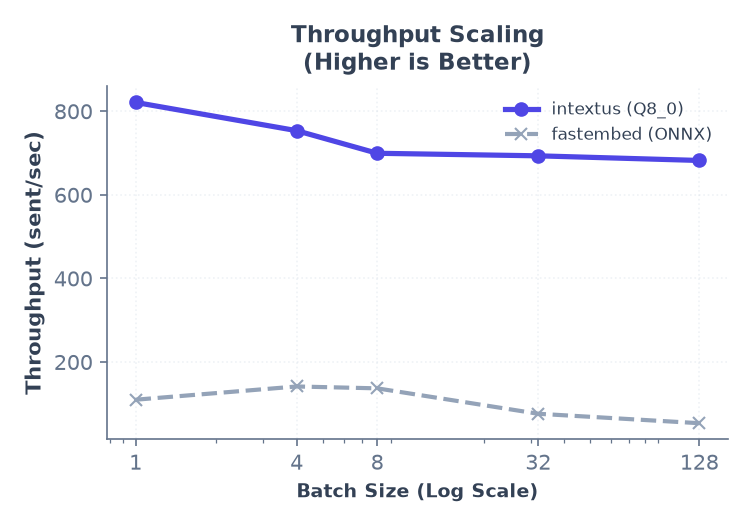
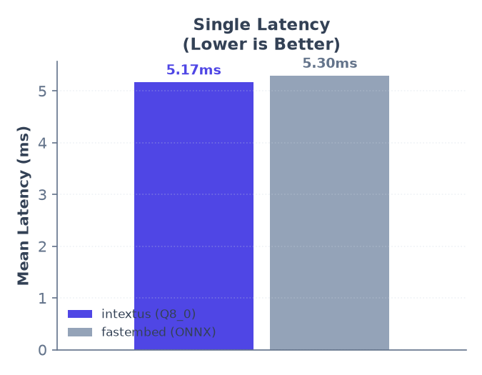
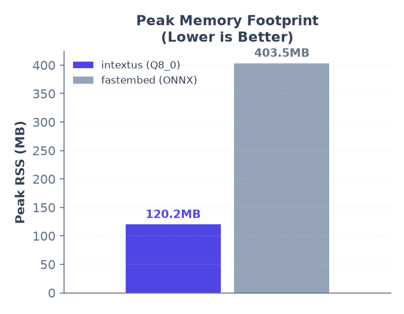
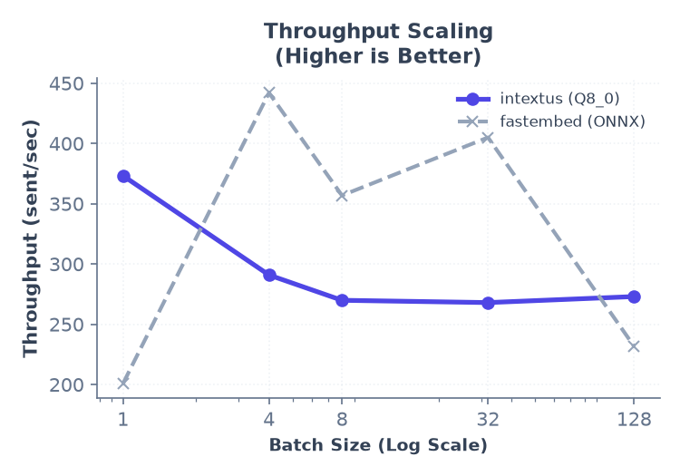

# intextus

[](https://pypi.org/project/intextus-embed-ggml/)
[](https://github.com/intextus/intextus-embed-ggml/actions/workflows/publish.yml)
[](https://pypi.org/project/intextus-embed-ggml/)
[](https://pypi.org/project/intextus-embed-ggml/)
[](https://pypi.org/project/intextus-embed-ggml/)
[](https://opensource.org/licenses/MIT)

A lightweight, zero-PyTorch, zero-ONNX-Runtime dense embedding inference engine. Uses a native C++ extension (`llama.cpp` native tokenization) to encode text extremely fast without pulling in gigabytes of deep learning dependencies.

## Install

```bash
pip install intextus-embed-ggml
```

Only runtime dependencies are `numpy` and `huggingface-hub`.

## Usage

```python
from intextus import DenseEncoder

# Initializes the encoder, downloading the optimized Q8_0 quantized all-MiniLM-L6-v2 GGUF model automatically
model = DenseEncoder("sentence-transformers/all-MiniLM-L6-v2")

embeddings = model.encode(["What is a dense embedding?", "It's extremely fast and lightweight."])
print(embeddings.shape)  # (2, 384)

# Load BAAI General Embedding model (auto-resolves to GGUF and uses CLS pooling)
bge_model = DenseEncoder("BAAI/bge-small-en-v1.5")
bge_embeddings = bge_model.encode(["BAAI General Embedding models use CLS pooling."])
```

You can also point it at a local directory containing a `.gguf` file or directly to a `.gguf` file path:

```python
model = DenseEncoder("./my-local-model-directory/")
# OR
model = DenseEncoder("./models/all-MiniLM-L6-v2-Q8_0.gguf")
```

### Supported Out-of-the-Box Models

The engine automatically handles GGUF model downloading, caching, and pooling settings for the following pre-quantized models hosted on Hugging Face:

- `sentence-transformers/all-MiniLM-L6-v2` (default, Mean Pooling, 384 dimensions)
- `BAAI/bge-small-en-v1.5` (CLS Pooling, 384 dimensions)
- `lightonai/DenseOn` (ModernBERT architecture, CLS Pooling, 768 dimensions)

You can query the list programmatically:

```python
from intextus import DenseEncoder

print(DenseEncoder.list_supported_models())
# ['sentence-transformers/all-MiniLM-L6-v2', 'BAAI/bge-small-en-v1.5', 'lightonai/DenseOn']
```

## Configuration Options

- `model_name_or_path`: Local path to a GGUF file or directory, or a Hugging Face Hub model ID (defaults to `"sentence-transformers/all-MiniLM-L6-v2"`).
- `tokenizer_path`: Optional explicit path to `tokenizer.json` (no longer required, as llama.cpp loads vocabulary natively from the GGUF model).
- `num_threads`: Number of CPU threads to use. Defaults to `0` (which automatically detects and uses physical CPU cores, avoiding hyperthreading bottlenecks).
- `quantization`: Preferred quantization format (e.g., `"Q8_0"`, `"F16"`, `"F32"`, `"Q4_0"`). Defaults to `"Q8_0"`.
- `pooling_mode`: Pooling strategy to use (`"mean"` or `"cls"`). Defaults to `None` (which auto-detects based on the model name).

## Benchmarks & Reproducibility

To reproduce the latency, memory footprint (RSS), and quantization accuracy results, run the scripts directly using `uv`:

```bash
# 1. Run the latency and memory benchmark (automatically manages fastembed dependency)
uv run --group benchmark python scripts/benchmark.py

# 2. Run the quantization accuracy benchmark
uv run python scripts/benchmark_accuracy.py
```

### Benchmark Results & Visualizations

Below is the comparison data and performance charts measured on AMD64 CPU (Linux):

### Model: sentence-transformers/all-MiniLM-L6-v2 (Mean Pooling)

<p align="center">
  
  
</p>


| Metric | intextus (Q8_0) | fastembed (ONNX) | Speedup / Savings |
| :--- | :---: | :---: | :---: |
| Model Load Time | 1418.8 ms | 15163.7 ms | 10.69x |
| Single Latency (Mean) | 2.15 ms | 8.50 ms | **3.96x** |
| Single Latency (p50) | 2.11 ms | 8.03 ms | **3.81x** |
| Single Latency (p95) | 2.49 ms | 10.71 ms | - |
| Peak RSS Memory | 106.2 MB | 945.3 MB | **8.90x less** |

**Batch Latency & Throughput**

<p align="center">
  
</p>

| Batch Size | intextus Latency (per-sent) | fastembed Latency (per-sent) | intextus Throughput | fastembed Throughput |
| :---: | :---: | :---: | :---: | :---: |
| 1 | 1.22 ms | 9.11 ms | **821.2 sent/s** | 109.8 sent/s |
| 4 | 1.33 ms | 7.07 ms | **753.6 sent/s** | 141.5 sent/s |
| 8 | 1.43 ms | 7.30 ms | **699.5 sent/s** | 137.0 sent/s |
| 32 | 1.44 ms | 13.12 ms | **693.4 sent/s** | 76.2 sent/s |
| 128 | 1.47 ms | 18.67 ms | **682.3 sent/s** | 53.6 sent/s |

### Model: BAAI/bge-small-en-v1.5 (CLS Pooling)

<p align="center">
  
  
</p>


| Metric | intextus (Q8_0) | fastembed (ONNX) | Speedup / Savings |
| :--- | :---: | :---: | :---: |
| Model Load Time | 1645.5 ms | 11304.1 ms | 6.87x |
| Single Latency (Mean) | 5.17 ms | 5.30 ms | **1.02x** |
| Single Latency (p50) | 5.16 ms | 5.19 ms | **1.01x** |
| Single Latency (p95) | 5.97 ms | 5.93 ms | - |
| Peak RSS Memory | 120.2 MB | 403.5 MB | **3.36x less** |

**Batch Latency & Throughput**

<p align="center">
  
</p>

| Batch Size | intextus Latency (per-sent) | fastembed Latency (per-sent) | intextus Throughput | fastembed Throughput |
| :---: | :---: | :---: | :---: | :---: |
| 1 | 2.68 ms | 4.98 ms | **373.3 sent/s** | 200.7 sent/s |
| 4 | 3.44 ms | 2.26 ms | **290.9 sent/s** | 442.0 sent/s |
| 8 | 3.71 ms | 2.80 ms | **269.9 sent/s** | 356.9 sent/s |
| 32 | 3.73 ms | 2.47 ms | **268.0 sent/s** | 405.0 sent/s |
| 128 | 3.66 ms | 4.31 ms | **273.0 sent/s** | 231.8 sent/s |

### Quantization Accuracy vs. F32 Baseline

Below is the cosine similarity accuracy comparison of different quantization formats vs the unquantized `F32` baseline, measured over a set of diverse test sentences:

| Quantization | Size (MiniLM) | Cosine Similarity vs. F32 | Status / Recommendation |
| :--- | :---: | :---: | :--- |
| **`F32`** | 86.7 MiB | 1.000000 | Baseline |
| **`F16`** | 43.4 MiB | 1.000000 | Near Lossless |
| **`Q8_0`** | 23.5 MiB | 0.999659 | **Highly Recommended** (virtually lossless, 3.7x smaller) |
| **`Q4_0`** | 18.4 MiB | 0.970772 | Not Recommended (noticeable drop in semantic accuracy) |

> 💡 **Tip:** For small embedding models like MiniLM and BGE-small, 8-bit quantization (`Q8_0`) is the absolute sweet spot, retaining **99.96% accuracy** while reducing memory footprint and load times. Lower bit-depths like 4-bit (`Q4_0`) suffer noticeable quality loss due to the small parameter capacity of these architectures.

### Model: lightonai/DenseOn (ModernBERT, CLS Pooling)

We have conducted a detailed evaluation of accuracy loss, file size compression, and CPU inference latency across all 9 quantization formats of the `lightonai/DenseOn` model (ranging from Float32 to 2-bit quantization). 

For detailed tables, recommendation guides, and performance charts, please read the full [DenseOn Quantization & Accuracy Results](docs/dense_on/accuracy_report.md).

## Advanced: Compile from Source (Hardware Acceleration)

By default, pre-built binary wheels are compiled with native SIMD instructions (AVX2/AVX-512/ARM NEON) for maximum CPU portability. If you are compiling from source and want to link against optimized system BLAS backends, pass the appropriate CMake arguments during installation:

- **AMD / Generic CPUs (OpenBLAS)**:
  ```bash
  CMAKE_ARGS="-DGGML_OPENBLAS=ON" pip install --no-binary :all: intextus-embed-ggml
  ```
- **Intel CPUs (Intel MKL / oneDNN)**:
  ```bash
  CMAKE_ARGS="-DGGML_MKL=ON" pip install --no-binary :all: intextus-embed-ggml
  ```

## Features

- **GGUF-Native**: Avoids PyTorch and ONNX Runtime entirely.
- **Hardware Optimized**: Compiled with native SIMD instructions (AVX2/AVX-512/ARM NEON) and Flash Attention support.
- **Dynamic Threading**: Auto-detects physical CPU cores to prevent runtime CPU thread thrashing.
- **Highly Portable**: No complex system level dependencies, builds easily on macOS, Linux, and Windows.

## License

MIT. See [LICENSE](LICENSE).
