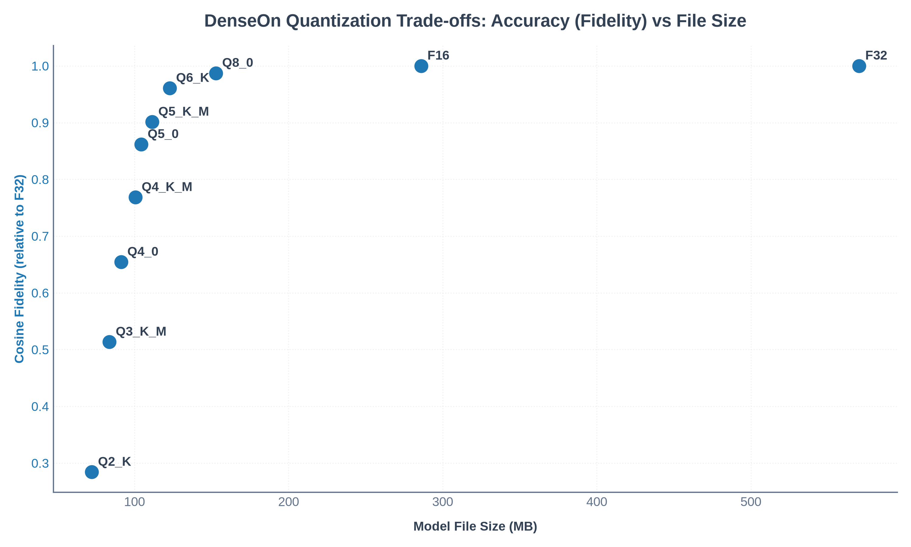
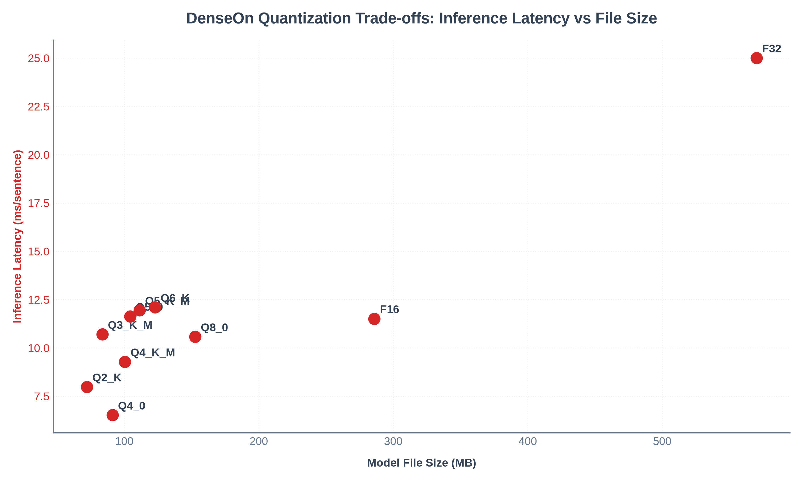
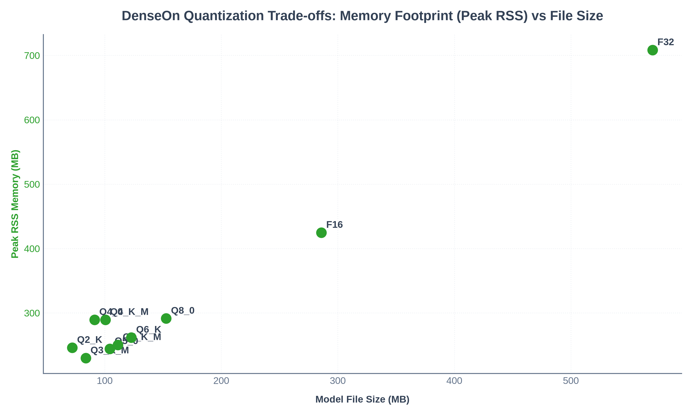

# DenseOn Quantization & Accuracy Report

This report evaluates the accuracy loss, file size reduction, and inference performance across various quantization configurations of the `lightonai/DenseOn` embedding model using the `intextus-embed-ggml` C++ inference backend.

## Evaluation Methodology

- **Baseline**: `DenseOn-F32` (Float32 unquantized model).
- **Evaluation Dataset**: A diverse set of 30 test sentences covering tech, medical, finance, and general conversations.
- **Cosine Fidelity**: The average cosine similarity between embeddings generated by the quantized model and the F32 baseline. Higher is better (max: 1.0).
- **MSE (Mean Squared Error)**: The squared differences between quantized embeddings and F32 embeddings. Lower is better (min: 0.0).
- **Latency**: Measured on CPU (single-sentence encoding time in milliseconds).
- **Memory Footprint**: Peak RSS (Resident Set Size) measured during model loading and inference in isolated processes.

## Results Summary Table

| Quantization | File Size (MB) | Size Reduction (%) | Peak RSS Memory (MB) | Cosine Fidelity | MSE | Latency (ms/sentence) | Speedup |
| :--- | :---: | :---: | :---: | :---: | :---: | :---: | :---: |
| **F32** | 570.1 MB | 0.0% | 708.4 MB | 1.000000 | 0.000000 | 25.01 ms | 1.00x |
| **F16** | 286.0 MB | 49.8% | 424.8 MB | 0.999938 | 0.000000 | 11.51 ms | 2.17x |
| **Q8_0** | 152.8 MB | 73.2% | 291.4 MB | 0.987205 | 0.000033 | 10.58 ms | 2.36x |
| **Q6_K** | 122.9 MB | 78.4% | 261.9 MB | 0.960699 | 0.000102 | 12.10 ms | 2.07x |
| **Q5_K_M** | 111.4 MB | 80.5% | 250.5 MB | 0.901140 | 0.000257 | 11.95 ms | 2.09x |
| **Q5_0** | 104.4 MB | 81.7% | 244.2 MB | 0.861635 | 0.000360 | 11.64 ms | 2.15x |
| **Q4_K_M** | 100.5 MB | 82.4% | 289.5 MB | 0.768347 | 0.000603 | 9.28 ms | 2.70x |
| **Q4_0** | 91.3 MB | 84.0% | 289.5 MB | 0.654260 | 0.000900 | 6.52 ms | 3.83x |
| **Q3_K_M** | 83.7 MB | 85.3% | 229.8 MB | 0.513440 | 0.001267 | 10.70 ms | 2.34x |
| **Q2_K** | 72.2 MB | 87.3% | 246.1 MB | 0.284119 | 0.001864 | 7.98 ms | 3.13x |

## Batch Throughput & Latency

Below is the CPU batch encoding throughput (in sentences per second) across different quantization types and batch sizes:

| Quantization | BS=1 | BS=4 | BS=8 | BS=32 | BS=128 |
| :--- | :---: | :---: | :---: | :---: | :---: |
| **F32** | 46.1 sent/s | 46.5 sent/s | 40.9 sent/s | 44.1 sent/s | 45.6 sent/s |
| **F16** | 87.2 sent/s | 82.1 sent/s | 75.2 sent/s | 71.7 sent/s | 71.0 sent/s |
| **Q8_0** | 95.3 sent/s | 81.3 sent/s | 73.7 sent/s | 71.1 sent/s | 71.8 sent/s |
| **Q6_K** | 79.1 sent/s | 70.8 sent/s | 62.8 sent/s | 61.9 sent/s | 60.2 sent/s |
| **Q5_K_M** | 74.4 sent/s | 63.6 sent/s | 56.8 sent/s | 56.7 sent/s | 52.9 sent/s |
| **Q5_0** | 86.5 sent/s | 72.9 sent/s | 64.8 sent/s | 64.7 sent/s | 61.1 sent/s |
| **Q4_K_M** | 117.3 sent/s | 106.5 sent/s | 93.0 sent/s | 88.1 sent/s | 94.2 sent/s |
| **Q4_0** | 135.6 sent/s | 124.3 sent/s | 113.9 sent/s | 111.9 sent/s | 113.3 sent/s |
| **Q3_K_M** | 78.8 sent/s | 68.8 sent/s | 61.7 sent/s | 61.8 sent/s | 60.2 sent/s |
| **Q2_K** | 104.5 sent/s | 97.4 sent/s | 86.6 sent/s | 85.3 sent/s | 86.1 sent/s |

## Visualization & Performance Charts

### 1. Accuracy vs File Size

*The plot shows the relationship between model file size and embedding fidelity relative to Float32. Notice how **Q8_0** and **Q4_K_M** offer excellent compression with minimal fidelity loss.*

### 2. Inference Latency vs File Size

*The plot displays the CPU inference speed across quantization sizes. Lower file sizes yield faster decoding times, with Q4_0 and Q2_K providing significant performance speedups.*

### 3. Peak RSS Memory vs File Size

*The plot displays the peak memory footprint (RSS) across quantization sizes. High compression quantizations significantly reduce RAM utilization during inference.*

## Key Findings & Recommendations

1. **Recommended for General Use (Q8_0)**:
   - **Fidelity**: `0.9872`.
   - **Size**: `152.8 MB` (73.2% size reduction from Float32).
   - **Peak RSS**: `291.4 MB`.
   
2. **Recommended for Resource-Constrained Environments (Q4_K_M)**:
   - **Fidelity**: `0.7683`.
   - **Size**: `100.5 MB` (82.4% size reduction).
   - **Peak RSS**: `289.5 MB`.
   - **Performance**: Significant speedup on CPU.

3. **Performance Warning (Q2_K)**:
   - While Q2_K reduces the model size to under `72.2 MB` and is extremely fast, its fidelity drops to `0.2841` relative to the baseline. Use only where system memory is extremely restricted.
